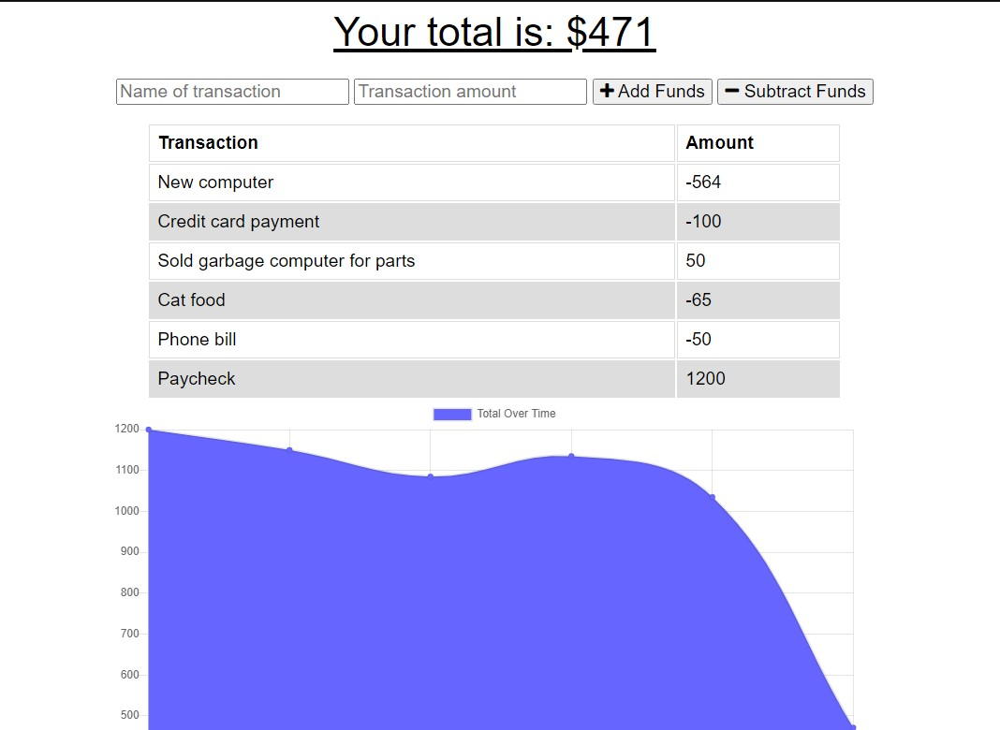

# Budget Tracker - PWA

## Acceptance Criteria
GIVEN a user is on Budget App without an internet connection
WHEN the user inputs a withdrawal or deposit
THEN that will be shown on the page, and added to their transaction history when their connection is back online.

## How It Works
Starter code was given that included the HTML, CSS, and API routes. There was no set up for caching data or saving transactions while offline.  
  
In order to turn this into a functioning app with online/offline functionality, the following needed to happen:
- Set up manifest.webmanifest file with app info and icons
- Set up a service-worker.js file to cache the necessary data--including the given public files and the data from API fetch requests
- Set up a js file with functionality to save new data to IndexedDB if offline, then tranfer it to the MongoDB database when back online

## Link and Screenshots

[Deployed Application on Heroku](https://ancient-tor-53184.herokuapp.com/)  
  
  

